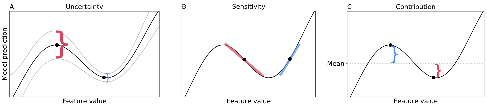

    # sensible local interpretations

*Note: this repo is actively maintained. For any questions please file an issue.*

This project aims to provide a way to interpret individual predictions made by a model in terms of 3 things: (1) uncertainty, (2) contribution, and (3) sensitivity. The methods here are model-agnostic and fast. The main source code is in the [sli](sli) folder.




## definitions
1. uncertainty
    - in addition to original model, train model with one class upweighted, one class downweighted
    - use these additional models to get info about uncertainty (mostly aleatoric)
    - can define uncertainty as overconfident prediction - underconfident prediction
2. ICE-sensitivity
    - how does changing this feature change the prediction, holding all other features constant?
3. ICE-contribution
    - how does this prediction differ from a typical prediction?


## usage

The outcome allows for an interactive exploration of how a model makes its prediction. Demo: https://csinva.github.io/sensible-local-interpretations/results/interp/out_breast_cancer.html

Install with `pip install git+https://github.com/csinva/sensible-local-interpretations`

Given one trained model:

```
from sli import Explainer
explainer = Explainer(X, strategy=strategy)
expl_dict = explainer.explain_instance(x, model.predict_proba, return_table=False)
explainer.viz_expl(expl_dict, filename='out.html')
```

Given a list of three models (with the best model in the middel of the list):

```
expl_dicts = [expl_dicts.append(explainer.explain_instance(x, models[i].predict_proba, 
              class_num, return_table=False)) for i in range(3)]
explainer.viz_expl(expl_dicts[1], [expl_dicts[0], expl_dicts[2]], 
                   point_id='ID001', filename='out.html')
```